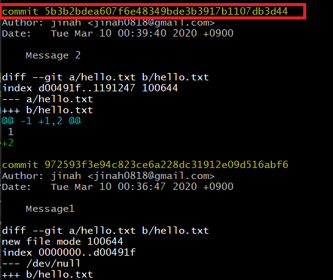

# checkout

### checkout : 특정 버전으로 working tree를 변경시키는 방법

### 1. git log - p

- 버전 히스토리 확인
- 이동할 버전의 commit의 식별자 복사

### 2. checkout [이동할 버전 식별자]

- git log로 HEAD 확인

    
    
    

### 3. git checkout master  (가장 최신 버전으로 이동)

- 최신 버전으로 관리된 것을 확인 (hello2.txt)

    

    

- Head 확인

    